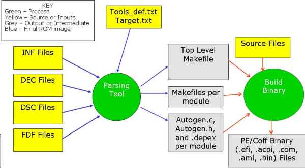
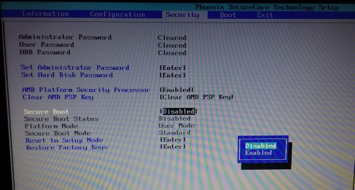
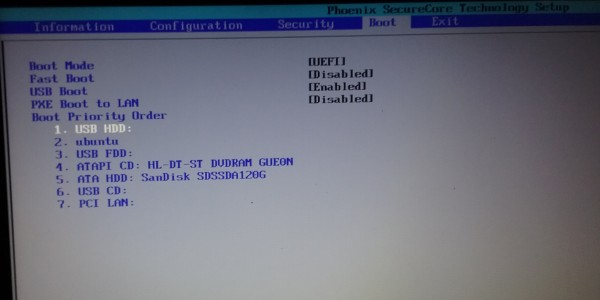
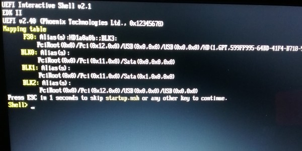

# Section 2: EFI Development

[Previous: Introduction and Overview](../../README.md)

----------------------

This page describes `EDK II` and `gnu-efi`, two different sets of tools for developing UEFI images. From the main [TianoCore](http://www.tianocore.org/) page:

> TianoCore is the community supporting an open-source implementation of UEFI. EDK II is a modern, feature-rich, cross-platform firmware development environment for the UEFI and UEFI Platform Initialization (PI) specifications.

[EFI Toolkit](https://github.com/tianocore/tianocore.github.io/wiki/EFI-Toolkit) is an older set of tools for EFI development. Since EDK II replaced EFI tool kit, EFI tool kit is no longer supported. However, `gnu-efi` is a package derived from EFI Toolkit. A lot of open-source projects in the Linux community are based on `gnu-efi` such as [`systemd-boot`](https://wiki.archlinux.org/index.php/systemd-boot).
 
The two main advantages of EDK II are (1) the active community with frequent updates and stable yearly releases and (2) the cross-platform build process that works on both Linux and Windows and with a range of development tools (gcc, icc, Visual Studio etc ... ). The main drawback is that the EDK II build process is a bit more complicated and non-standard, not based on Makefiles familiar to most Linux developers. In contrast, `gnu-efi` projects use traditional Makefiles. However `gnu-efi` does not provide the large number of libraries, documentation, or sample source code available with EDK II.

## EDK II

### Useful Resources
_The content in this section is largely derived from the resources listed below_

*   [Main EDK II repository](https://github.com/tianocore/edk2)
*   [Getting Started](https://github.com/tianocore/tianocore.github.io/wiki/Using-EDK-II-with-Native-GCC)
*   [Various documents](https://github.com/tianocore/tianocore.github.io/wiki/EDK-II-Documents)
    *   [User Documentation](https://github.com/tianocore/tianocore.github.io/wiki/EDK-II-User-Documentation)
        *   [EDK II User Manual](https://github.com/tianocore-docs/Docs/raw/master/User_Docs/EDK_II_UserManual_0_7.pdf)
        *   [EDK II Module Writer's Guide](https://github.com/tianocore-docs/Docs/raw/master/User_Docs/EDK_II_Module_Writer_s_Guide_0_7.pdf)
    *   [Specifications](https://github.com/tianocore/tianocore.github.io/wiki/EDK-II-Specifications)
        *   [Build Specification](https://www.gitbook.com/download/pdf/book/edk2-docs/edk-ii-build-specification)
        *   [DSC Specification](https://www.gitbook.com/download/pdf/book/edk2-docs/edk-ii-dsc-specification)
        *   [INF Specification](https://www.gitbook.com/download/pdf/book/edk2-docs/edk-ii-inf-specification)
*   [EDK II Libraries and Helper Files](https://github.com/tianocore/tianocore.github.io/wiki/EDK-II-Libraries-and-Helper-files)

### Setting Up EDK II on Ubuntu

For Ubuntu 16.04, some packages must be installed as shown below:

        $ sudo apt-get install build-essential uuid-dev acpica-tools iasl git gcc-5 nasm

Clone the repository as shown below:

        $ git clone https://github.com/tianocore/edk2
        $ cd edk2

Compile the build tools:

        $ make -C edk2/BaseTools

Set up the bash shell environment:

        $ export EDK_TOOLS_PATH=<path to edk2 directory>/edk2/BaseTools
        $ . edksetup.sh BaseTools

Modify the build-target configuration by editing the file "`Conf/target.txt`". This file specifies the build platform, target architecture, tool chain, and multi-threading options. In the example presented below, "`Conf/target.txt`" is set for edk2 to build the `ShellPkg` for `X64` platforms using `GCC5`.

Modify the `ACTIVE_PLATFORM` line with the relative path of the desired project. For this example, it is changed from `Nt32Pkg/Nt32Pkg.dsc` to `ShellPkg/ShellPkg.dsc`.

Modify the `TARGET_ARCHITECTURE` for the desired target. For this example, it is changed from `IA32` to `X64`.

Modify the `TOOL_CHAIN_TAG` with the correct tool chain. For this example, it is changed from `MYTOOLS` to `GCC5`. The list of supported tool chains and corresponding tags are defined in `Conf/tools_def.txt`.

Modify the `MAX_CONCURRENT_THREAD_NUMBER` as appropriate for parallel builds (equivalent to `-j` argument of `make`).

Finally, run `build` in the `edk2` root directory. Once build completes, the binary image for the EFI shell application should be present in the `Build` directory.

        $ ls Build/Shell/DEBUG_GCC5/X64/Shell.efi
        Build/Shell/DEBUG_GCC5/X64/Shell.efi

Note: the "`Conf/target.txt`" determines what builds by default. Any package or module within a package can be built by passing the `-p` and `-m` arguments to the `build` command. Run the following `build` command to build the `Hello` module inside `AppPkg`. (Packages and modules are described in greater detail in the following section.)

        $ build -p AppPkg/AppPkg.dsc -m AppPkg/Applications/Hello/Hello.inf

As before, once build completes, the binary image for the hello-world application should be present in the `Build` directory.

        $ ls Build/AppPkg/DEBUG_GCC5/X64/Hello.efi
        Build/AppPkg/DEBUG_GCC5/X64/Hello.efi

The equivalent of `make clean` is `build clean` or `build cleanall`. In the same way as for just `build`, `build clean` can be passed the `-p` and `-m` arguments to specify a specific project or module.

### Components

A __library class__ is a set of standard API definitions that are used to provide certain functionality. Different projects might require the same functionality but different implementations of that functionality. A module writer can directly use a library class for development.

A __library instance__ supplies the implementation of these APIs. The relationship between library class and library instance is one-to-many. A library class may have multiple implementations, that is, multiple library instances.

A module only depends on a library class and not concrete implementations, so the same module source code can be easily configured to link with different library instances for various requirements.

A __module__ is the smallest piece of separately compilable code or pre-built binary. A module is either an executable image or a library instance. There are various types of modules. The scope of this page is limited to EFI-application modules.

A __package__ is a container in which a set of modules (zero or more) are organized together in accordance with certain purpose or rule. Functionally, a package is a logical division of a project. Developers depend on reasonable judgment, such as license or specification compliance, to determine where to place a module.

### Project Organization and Build Mechanism

> The EDK II build system is based on Python and portable C code to provide cross-platform build-ability. The following figure (from the EDK II Module Writer's guide) illustrates the conceptual workflow of the EDK II build system infrastructure.

There are two main aspects of any package: what functionality the package exports (library-class implementations), and how the components of the package are built. As seen in the above illustration, this information is supplied in configuration files that are then processed by the EDK II build system to generate intermediate files. The intermediate files along with the source files are used to build final binary objects.

The configuration files are essentially [INF files](https://en.wikipedia.org/wiki/INF_file) with minor variations. INF files are divided into sections. Within each section there are lines that can be key/value pairs or just lists.

_Refer to the documents listed earlier under "Useful Resources" for more details on the build process and these files in general._

#####DEC File

The package declaration file (__DEC__, "`.dec`") is used to define a package's public interfaces. The public interfaces are the package’s public header files and other exported components (GUIDs will be explained in a later section. PCDs are outside the scope of this tutorial). For packages that just contain stand-alone applications, and do not serve as dependencies for other packages, there is no need for public interfaces, and the `DEC` file can be left out.

#####DSC File

The platform build description (__DSC__, "`.dsc`") file includes a list of package components to be built and the list of dependencies (library classes) needed to build those components. 

DSC files consist of several sections. Refer to the "EDK II Platform Description (DSC) File Specification" for a complete list of sections. Some of the sections are listed below:

*   The __`[Defines]`__ section sets build related information, such as the build output directory, build target, and build ARCHs.

*   The __`[Components]`__ section lists all modules to be built in the package. The modules may be drivers, applications, and libraries instances.

*   The __`[LibraryClasses]`__ section specifies the chosen library instance for every library class, which is consumed by the drivers and applications in the `[Components]` section.

*   The __`[BuildOptions]`__ section is used to define module specific tool chain flags rather than use the default flags for a module. These flags are appended to any standard flags that are defined by the build process.

#####INF File

The EDK II INF meta-data file (__INF__, "`.inf`") describes properties of a module, how it is coded, what it provides, what it depends on, architecture specific items, features, etc. regarding the module. To build the module as a part of a package, its INF file must be specified into the `[Components]` section of a DSC file, and its dependent library instances also need to be set in the corresponding section of the DSC file. Each module may have one or more INF files that can be used by tools to generate images.

The intent of a module's INF file is to define the source files, libraries, and definitions relevant to building the module, creating binary files that are either raw binary files or PE32/PE32+/coff format files.

Similar to DSC files, INF files consist of several sections. Refer to the "EDK II Module Information (INF) File Specification" for a complete list of sections. Some of the sections are listed below:

*   The __`[Defines]`__ section contains a module's basic information, such as name, GUID, module type (application or library instance), entry point for application modules, and what library class is implemented for library-instance modules.

*   The __`[Sources]`__ section contains patha to binary files or source files included in the module.

*   The __`[Packages]`__ section path to any packages (DEC files) the module is dependent on.

*   The __`[LibraryClasses]`__ section contains a list of all the Library classes required by the module.

*   The __`[BuildOptions]`__ section is used to define module specific tool chain flagsrather than use the default flags for a module. These flags are appended to any standard flags that are defined by the build process.

### A Minimal EDK II Hello-World Project

A bare-minimum hello-world EDK II project is available as a part of this repository at the path, "`<tutorial root directory>/src/edk2projs/HelloPkgMin/`". The package contains a single EFI application that prints "`Hello EDK II!`". To build this package:

1.  Copy the above directory to the EDK II root dirctory and build as shown below:

        $ cp -r src/edk2projs/HelloPkgMin/ <EDK II source directory>/

2.  Open the EDK II source directory, set environment variables, and build the package with the following commands:

        $ cd <EDK II source directory>/
        $ . edksetup.sh
        $ build -p HelloPkgMin/HelloPkgMin.dsc

3.  After the build completes, the build output should be available within the same directory as shown below:

        $ ls HelloPkgMin/Build/RELEASE_GCC48/X64/HelloWorldMin.efi 
        HelloPkgMin/Build/RELEASE_GCC48/X64/HelloWorldMin.efi

The INF file for the HelloWorld application is shown below:

        [Defines]
          INF_VERSION                    = 0x00010005
          BASE_NAME                      = HelloWorldMin
          FILE_GUID                      = 53023f7d-62ad-4024-82a3-cfe9742edcfd
          MODULE_TYPE                    = UEFI_APPLICATION
          VERSION_STRING                 = 1.0
          ENTRY_POINT                    = UefiMain

        #  This flag specifies whether HII resource section is generated into PE image.
          UEFI_HII_RESOURCE_SECTION      = TRUE

        # The following information is for reference only and not required by the build tools.
        #  VALID_ARCHITECTURES           = IA32 X64

        [Sources]
          HelloWorldMin.c

        [Packages]
          MdePkg/MdePkg.dec

        [LibraryClasses]
          UefiApplicationEntryPoint
          UefiLib

The DSC file for this package is shown below:

        [Defines]
          PLATFORM_NAME                  = HelloMin
          PLATFORM_GUID                  = e1fcd28c-f219-11e6-b657-d89d67f40bd7
          PLATFORM_VERSION               = 0.01
          DSC_SPECIFICATION              = 0x00010005
          OUTPUT_DIRECTORY               = HelloPkgMin/Build/
          SUPPORTED_ARCHITECTURES        = IA32|X64
          BUILD_TARGETS                  = RELEASE|NOOPT
          SKUID_IDENTIFIER               = DEFAULT

        [LibraryClasses]
          # Entry point
          UefiApplicationEntryPoint|MdePkg/Library/UefiApplicationEntryPoint/UefiApplicationEntryPoint.inf
          # Basic
          BaseLib|MdePkg/Library/BaseLib/BaseLib.inf
          BaseMemoryLib|MdePkg/Library/BaseMemoryLib/BaseMemoryLib.inf
          PrintLib|MdePkg/Library/BasePrintLib/BasePrintLib.inf
          # UEFI & PI
          UefiBootServicesTableLib|MdePkg/Library/UefiBootServicesTableLib/UefiBootServicesTableLib.inf
          UefiRuntimeServicesTableLib|MdePkg/Library/UefiRuntimeServicesTableLib/UefiRuntimeServicesTableLib.inf
          UefiLib|MdePkg/Library/UefiLib/UefiLib.inf
          DevicePathLib|MdePkg/Library/UefiDevicePathLib/UefiDevicePathLib.inf
          # Generic Modules
          PcdLib|MdePkg/Library/BasePcdLibNull/BasePcdLibNull.inf
          # Misc
          DebugLib|MdePkg/Library/BaseDebugLibNull/BaseDebugLibNull.inf

        [LibraryClasses.common.UEFI_APPLICATION]
          MemoryAllocationLib|MdePkg/Library/UefiMemoryAllocationLib/UefiMemoryAllocationLib.inf

        [Components]
          HelloPkgMin/HelloWorldMin.inf

        [BuildOptions]
          *_*_*_CC_FLAGS = -D DISABLE_NEW_DEPRECATED_INTERFACES

Note, the `[LibraryClasses]` section of the `dsc` file specifies library instances for more than just the library classes listed in the `inf` file. These additional library instances are specified because the library instances themselves have dependencies on other libraries classes.

### EDK II Directory Layout

There is a lot of existing features (library classes and instances, protocols, etc) implemented in EDK II. This section presents an overview of the EKD II directory structure to show whats there and where to find it. Doxygen-generated documentation can be found (in zipped files) from the following link: [EDK II Libraries and Helper files](https://github.com/tianocore/tianocore.github.io/wiki/EDK-II-Libraries-and-Helper-files).

The EDK II root directory is shown below:

        $ ls <EDK II root directory>
        AppPkg             BuildNotes2.txt     Edk2Setup.bat        EmulatorPkg              IntelFsp2Pkg         MdePkg          QuarkPlatformPkg  SourceLevelDebugPkg
        ArmPkg             BUMPkg              EdkCompatibilityPkg  FatBinPkg                IntelFsp2WrapperPkg  NetworkPkg      QuarkSocPkg       StdLib
        ArmPlatformPkg     Conf                edksetup.bat         FatPkg                   IntelFspPkg          Nt32Pkg         Readme.md         StdLibPrivateInternalFiles
        ArmVirtPkg         Contributions.txt   edksetup.sh          HelloPkg                 IntelFspWrapperPkg   Omap35xxPkg     SecurityPkg       UefiCpuPkg
        BaseTools          CorebootModulePkg   EdkShellBinPkg       HelloPkg2                IntelSiliconPkg      OptionRomPkg    ShellBinPkg       UnixPkg
        BeagleBoardPkg     CorebootPayloadPkg  EdkShellPkg          HelloPkgMin              License.txt          OvmfPkg         ShellPkg          Vlv2DeviceRefCodePkg
        BootUpdateManager  CryptoPkg           EFIWrap              IntelFrameworkModulePkg  Maintainers.txt      PcAtChipsetPkg  SignedCapsulePkg  Vlv2TbltDevicePkg
        Build              DuetPkg             EmbeddedPkg          IntelFrameworkPkg        MdeModulePkg         PerformancePkg  SimpleEFILoader

Most libraries that might be required by an EFI application are available in `MdePkg` and `MdeModulePkg`. The `MdePkg` declares PROTOCOLs, PPIs, GUIDs and related data structures defined in UEFI, EFI, and PI Specifications and industry standards. In addition, this package encompasses library instances defined in Module Development Environment, which provides services for all the execution phases in the Intel Platform Innovation Framework for EFI.

The MdeModulePkg provides a group of modules crossing platforms, based on UEFI, EFI, and PI Specifications. It also includes the libraries instances serviced for these modules.

Sometimes, the easiest way to find the header file containing a type definition or function header or any other symbol is to just run `grep` or `find` against the `MdePkg/Include` directory.

----------------------

## `gnu-efi`

`gnu-efi` can be installed as a standard package in Ubuntu.

        $ apt install gnu-efi

All thats needed to build a `gnu-efi` project is an appropriate `Makefile`. A bare-minimum hello-world `gnu-efi` project is available as a part of this repository at the path, "`<tutorial root directory>/src/gnu-efi/HelloWorld/`". The C source and `Makefile` (by Roderick W. Smith) are copied from [this page](https://www.rodsbooks.com/efi-programming/hello.html). The EFI application built with the C source and `Makefile` just prints "`Hello, world!`". To build the application, just enter the source directory and run `make`.

        $ cd src/gnuefi/HelloWorld/
        $ make
        cc -I/usr/include/efi -I/usr/include/efi/x86_64 -I/usr/include/efi/protocol -fno-stack-protector -fpic -fshort-wchar -mno-red-zone -Wall -DEFI_FUNCTION_WRAPPER   -c -o main.o main.c
        ld -nostdlib -znocombreloc -T /usr/lib/elf_x86_64_efi.lds -shared -Bsymbolic -L /usr/lib -L /usr/lib /usr/lib/crt0-efi-x86_64.o  main.o -o hello.so -lefi -lgnuefi
        objcopy -j .text -j .sdata -j .data -j .dynamic \
            -j .dynsym  -j .rel -j .rela -j .reloc \
            --target=efi-app-x86_64 hello.so hello.efi

The build process is summarized in the illustration below. 

The key details to note are:

1.  The final binary image should have a special (EFI) flavor of the PE/COFF format. (This is ensured with the final call to `objcopy`)
2.  The code contained in the image should be position-independent code (more on this in the next section). (Note the `-fpic` option passed to `gcc`)
3.  The code does not include standard C headers or link against the standard C library.
4.  The code has a non-standard entry point (no `int main(int argc, char **argv)`).

The `Makefile` is shown below:

        ARCH            = $(shell uname -m | sed s,i[3456789]86,ia32,)

        OBJS            = main.o
        TARGET          = hello.efi

        EFIINC          = /usr/include/efi
        EFIINCS         = -I$(EFIINC) -I$(EFIINC)/$(ARCH) -I$(EFIINC)/protocol
        LIB32           = /usr/lib32
        LIB64           = /usr/lib

        CFLAGS          = $(EFIINCS) -fno-stack-protector -fpic \
                            -fshort-wchar -mno-red-zone -Wall

        ifeq ($(ARCH),x86_64)
          CFLAGS += -DEFI_FUNCTION_WRAPPER
          LIB           = $(LIB64)
          EFILIB        = $(LIB64)
        endif

        ifeq ($(ARCH),ia32)
          LIB           = $(LIB32)
          EFILIB        = $(LIB32)
        endif

        EFI_CRT_OBJS    = $(EFILIB)/crt0-efi-$(ARCH).o
        EFI_LDS         = $(EFILIB)/elf_$(ARCH)_efi.lds

        LDFLAGS         = -nostdlib -znocombreloc -T $(EFI_LDS) -shared \
                          -Bsymbolic -L $(EFILIB) -L $(LIB) $(EFI_CRT_OBJS) 

        all: $(TARGET)

        hello.so: $(OBJS)
            ld $(LDFLAGS) $(OBJS) -o $@ -lefi -lgnuefi

        %.efi: %.so
            objcopy -j .text -j .sdata -j .data -j .dynamic \
              -j .dynsym  -j .rel -j .rela -j .reloc \
              --target=efi-app-$(ARCH) $^ $@

        clean:
            rm -f hello.efi hello.so main.o *~

To add or remove source files, modify the `OBJS =` line.

As mentioned earlier, `gnu-efi` is derived from EFI tool kit. The EFI tool kit can be downloaded from [this page](https://github.com/tianocore/tianocore.github.io/wiki/EFI-Toolkit). The PDF file in the EFI-Toolkit source directory, `doc/EFI_LIB.pdf`, contains a listing of available library functions.

Also, the easiest way to find the header file containing a type definition or function header or any other symbol is to just run `grep` or `find` against the header directory for the `gnu-efi` package. On Ubuntu, the header directory is located at `/usr/include/efi`.

----------------------

## Testing EFI Binaries

### Testing with an EFI Platform and Bootable Thumb Drive

Previous sections describe building EFI binaries with EDK II and `gnu-efi`. This section describes setting up a thumb drive and using it to test the binaries on a UEFI platform.

When booting from any storage device, EFI firmware attempts to load an image from the EFI system partition (ESP). The EFI boot process is described in more detail on [this page](../../README.md) and [this page](../bootmgr/bootmgr.md).

The storage device can be partitioned with either an MBR format or GPT format. The following sequence of commands clears (zeros) a thumb drive, `/dev/sdb`, partitions it with GPT format, and creates the ESP. The commands must be run as root.

        $ dd conv=sync if=/dev/zero of=/dev/sdb bs=128M
        $ parted /dev/sdb "mktable gpt"
        $ parted /dev/sdb "mkpart p fat32 2048s 2097152s"
        $ parted /dev/sdb "toggle 1 boot"
        $ parted /dev/sdb "name 1 UEFI"

Currently, UEFI only supports FAT filesystems. Format the newly created ESP with a FAT filesystem and mount it.

        $ mkfs -t vfat -n UEFI "/dev/sdb1"
        $ mkdir /mnt/efitest
        $ mount /dev/sdb1 /mnt/efitest

Create the required directory structure in the ESP, and copy the EFI shell built in earlier steps to to default boot location:

        $ mkdir -p /mnt/efitest/EFI/BOOT/
        $ cp <EDK II root directory>/Build/Shell/DEBUG_GCC5/X64/Shell.efi /mnt/efitest/EFI/BOOT/BOOTX64.EFI

Copy the other binaries to the ESP and unmount the ESP.

        $ cp <EDK II root directory>/HelloPkgMin/Build/RELEASE_GCC5/X64/HelloWorldMin.efi /mnt/efitest/
        $ cp <tutorial root directory>/src/gnu-efi/HelloWorld/hello.efi /mnt/efitest/
        $ umount /mnt/efitest

Since the newly-built images are not signed with aproopriate keys, the images will not pass UEFI signature checks. Reboot the system into the firmware-setup menu and disable secure boot. Also, ensure the system is configured to boot from the thumb drive first. Relevant parts of the firmware menu from an AMD laptop are shown in the images below:

**Figure: Disabling UEFI Secure Boot **

**Figure: Setting firmware to attempt booting from UEFI storage first**

Exit the firmware menu and boot the thumb drive. The EFI Shell should run:

**Figure: EFI Shell**

Set the ESP on the thumb drive as the current directory and run the hello-world image:

        Shell> fs0:
        FS0:\> HelloWorldMin.efi
        A simple EDK II hello
        FS0:\> hello.efi
        Hello, world!
        FS0:\> 

Remove the thumb drive and reboot the system:

        FS0:\> reset

NOTE: You may want to turn on secure boot again in the firmware menu for security.

### To Do: Unix EFI emulation environment

----------------------

[Next: EFI Execution Environment](../section3/section3.md)

